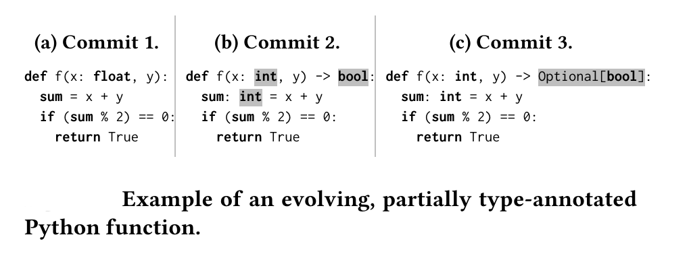
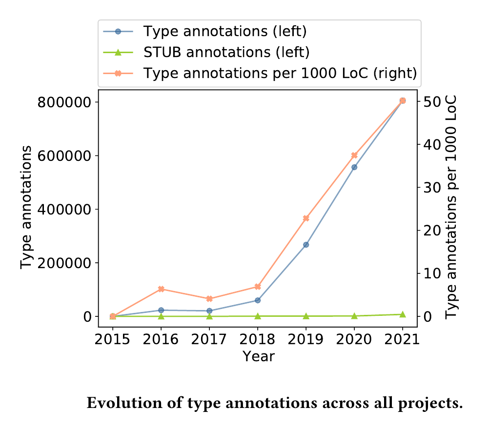
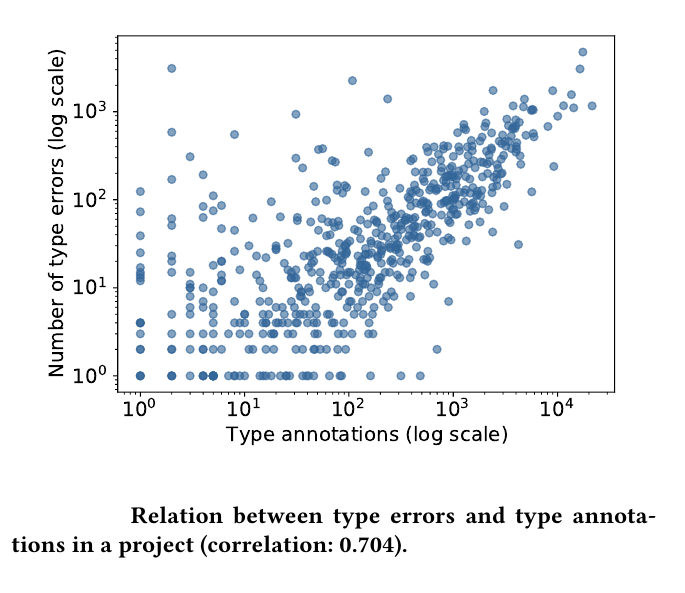

# The Evolution of Type Annotations in Python: An Empirical Study

Type annotations and gradual type checkers attempt to reveal errors and facilitate maintenance  in dynamically typed programming languages. Despite the availability of these features and tools, it is currently unclear how quickly developers are adopting them, what strategies they follow when doing so, and whether adding type annotations reveals more type errors.

This paper presents the first large-scale empirical study of the evolution of type annotations and type errors in Python. The study is based on an analysis of 1,414,936 type annotation changes, which we extract from 1,123,393 commits among 9,655 projects.
Our results show that (i) type annotations are getting more popular, and once added, often remain unchanged in the projects for a long time, (ii) projects follow three evolution patterns for type annotation usage -- regular annotation, type sprints, and occasional uses -- and that the used pattern correlates with the number of contributors, (iii) more type annotations help find more type errors (0.704 correlation), but nevertheless, many commits (78.3%) are committed despite having such errors. Our findings show that better developer training and automated techniques for adding type annotations are needed, as most code still remains unannotated, and they call for a better integration of gradual type checking into the development process.

  
   

The paper has been accepted for the ESEC/FSE 2022 conference and it is avaible [online](https://www.software-lab.org/publications/FSE22TypeAnnotationsStudy.pdf).

* **Reproduce the results**:
- Install requirements that are in ./requirements.txt:
	- pip3 install -r requirements.txt

- Run the following command for type annotation results:
	- python3 ./script_typeAnnotation_analysis.py
	- python3 ./PlotResultsAndComputeStats.py
	- All the results are in ./Resources/Output
		- Figure 2: ./Resources/annotationsPerYear2.pdf
		- Figure 3: ./Resources/elements_annotated.pdf
		- Figure 5: ./Resources/perc_annotations_lines_per_commit.pdf
		- Figure 7: ./Resources/num_changes.pdf
		- Figure 9: ./Resources/TopChanged_arg.pdf and ./Resources/TopChanged_ret.pdf and ./Resources/TopChanged_var.pdf
	
